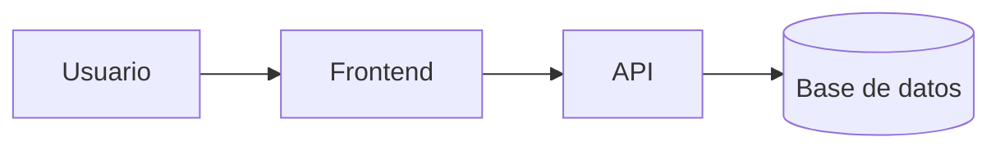

# Laboratorio README


Proyecto de práctica para aprender Markdown avanzado en GitHub.

## Descripción

Este repositorio documenta paso a paso mi aprendizaje de Markdown: tablas, listas de tareas, badges y diagramas.

## Estado de funcionalidades

| Función  | Estado      |
| -------- | ----------- |
| Login    | Listo       |
| Reportes | En progreso |

## pendientes

- [x] Diseño de la base de datos
- [ ] Pruebas unitarias

## Arquitectura



# 📚 Sistema de Gestión de Biblioteca


Una aplicación web diseñada para la administración eficiente de préstamos de libros, catálogo de títulos y registro de usuarios en tiempo real.

---

## Tabla de contenidos

- [Descripción](#descripción)
- [Instalación](#instalación)
- [Uso](#uso)
- [Estado de funcionalidades](#estado-de-funcionalidades)
- [Pendientes](#pendientes)
- [Arquitectura](#arquitectura)
- [Contribuidores](#contribuidores)

---

## Descripción

Esta herramienta permite a bibliotecas pequeñas y medianas gestionar su inventario de libros y controlar el préstamo a usuarios registrados. Cuenta con una interfaz intuitiva y un backend rápido para la búsqueda de títulos.

---

## Instalación

Clona el repositorio e instala las dependencias ejecutando:

```bash
git clone [https://github.com/TU-USUARIO/laboratorio-readme.git](https://github.com/TU-USUARIO/laboratorio-readme.git)
cd laboratorio-readme
npm install
```
